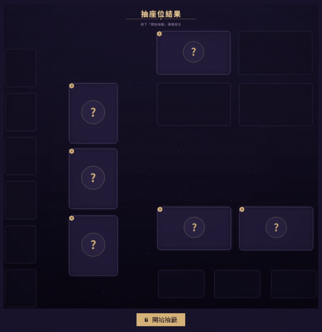

# RVL Pick Seat

用權重加權亂數抽座位，並用 GUI 視覺化結果（頭貼落在座位圖上）。

v0.1.1：GUI 版本，支援頭貼、座位版面設定檔、重新抽一次。

v0.1.2：加入「開始抽籤」按鈕（不再一開機就自動抽），並補上類似手遊抽卡的動畫流程──開場提示、快速洗牌後漸漸放慢、逐一揭曉座位；同時重新設計座位卡片視覺（陰影、光暈、圓角、徽章）。



## 安裝

使用 [uv](https://docs.astral.sh/uv/) 管理環境：

```bash
uv sync
```

## 範例 Demo

不想先建立真人名單也能直接試玩（上方動圖即為此範例資料的實際畫面）：
`configs/members.example.yaml`、`configs/seats_layout.example.yaml` 與
`assets/members.example/` 已內建一組假頭貼，可直接執行：

```bash
uv run pick-seat-gui \
  -c configs/members.example.yaml \
  --layout configs/seats_layout.example.yaml \
  --photos-dir assets/members.example
```

## 建立本機設定資料

實際姓名、抽籤偏好、座位版面與頭貼不納入版本控制（見 `.gitignore`）。第一次使用時先建立本機設定：

```bash
cp configs/members.example.yaml configs/members.yaml
cp configs/seats_layout.example.yaml configs/seats_layout.yaml
mkdir -p assets/members
```

接著編輯 `configs/members.yaml`，每位成員三個欄位：

```yaml
members:
  - name: 成員 A
    weight: 3            # 權重，越高越容易抽中心儀座位
    preferences: [1, 2]  # 心儀座位編號，不可為空
    photo: member-a.jpg  # 選填，對應 assets/members/ 底下的檔名
```

- 座位編號固定為 `1..N`（N = 成員人數），不用另外設定。
- `preferences` 不可為空；沒有特別偏好時請**列出全部座位編號**（這會被演算法視為懲罰，優先度最低，見下方演算法說明）。
- `photo` 為選填；省略或找不到圖片時，GUI 會自動顯示姓名首字的預設頭貼。

若要顯示頭貼，把圖片放進 `assets/members/`，並在對應成員加入 `photo` 欄位。

## 執行

```bash
uv run pick-seat-gui
```

跳出視窗顯示座位圖。按「重新抽一次」可用新的亂數重抽。

常用參數：

```bash
uv run pick-seat-gui --seed 42                     # 固定亂數種子，方便測試重現
uv run pick-seat-gui -c path/to/other_members.yaml  # 指定成員設定檔
uv run pick-seat-gui --layout configs/seats_layout.yaml  # 指定座位版面設定檔
```

## 字型

結果圖與動畫使用套件內附的 Noto Sans TC Regular/Bold，不依賴作業系統
已安裝的字型，因此在 Linux、Windows 與 macOS build 中會維持相同排版。
字型依 SIL Open Font License 1.1 散布，授權全文位於
`assets/fonts/OFL.txt`。

## 座位版面

座位圖由本機的 `configs/seats_layout.yaml` 定義；初始範本位於 `configs/seats_layout.example.yaml`。程式自己畫座位圖，不直接使用 `assets/seats.png`，該圖僅作版面參考。每個格子是一個 `[x, y, w, h]` 區塊，`seat` 對應 `members.yaml` 中的座位編號；`seat: null` 代表該格子只是房間裡的裝飾、不參與本次抽籤。想調整座位圖形狀或增刪座位，直接編輯本機設定檔即可。

## 演算法

### 數學模型

令成員數與座位數皆為 $n$，並記

$$
\mathcal M = \{1,\ldots,n\},
\qquad
\mathcal S = \{1,\ldots,n\}.
$$

對每位成員 $i\in\mathcal M$，給定權重 $w_i>0$ 與非空偏好集合
$P_i\subseteq\mathcal S$。演算法的輸出是一個隨機雙射

$$
\sigma:\mathcal M\longrightarrow\mathcal S,
$$

其中 $\sigma(i)$ 表示成員 $i$ 最終取得的座位。

### 優先權

令 $k_i=\lvert P_i\rvert$。先定義偏好稀缺函數

$$
b(k)=
\begin{cases}
1, & n=1,\\
n^{-\frac{k-1}{n-1}}, & n>1.
\end{cases}
$$

成員 $i$ 的稀缺係數 $b_i$ 與抽籤優先權 $p_i$ 為

$$
b_i=b(k_i),
\qquad
p_i=w_i b_i.
$$

當 $n>1$ 時，$b(k)$ 單調遞減，且

$$
b(1)=1,
\qquad
b(n)=\frac{1}{n}.
$$

因此，只指定一席時不折減權重；列出全部座位時，權重會縮至原本的
$1/n$。兩端之間採幾何內插，而且

$$
\frac{b(k+1)}{b(k)}=n^{-1/(n-1)},
\qquad 1\leq k<n,
$$

所以每多列一席，稀缺係數都乘上相同的比例。

### 抽籤順序

對每位成員獨立抽取

$$
U_i\overset{\mathrm{i.i.d.}}{\sim}\mathop{\mathrm{Unif}}(0,1),
\qquad
K_i=U_i^{1/p_i}.
$$

令 $\pi=(\pi_1,\ldots,\pi_n)$ 為依 $K_i$ 由大到小排列所得的隨機排列，
亦即

$$
K_{\pi_1}>K_{\pi_2}>\cdots>K_{\pi_n}.
$$

由於 $U_i$ 為連續隨機變數，平手事件的機率為零。$p_i$ 越大，$K_i$
傾向越大，因此成員 $i$ 傾向在排列 $\pi$ 中較早出現。

上述定義的具體算法如下。

**演算法 1**

$$
\mathrm{DraftOrder}(\mathcal M,\ (w_i)_{i\in\mathcal M},\ (P_i)_{i\in\mathcal M})
$$

```
輸入: 成員集合 M，權重 (w_i)，偏好集合 (P_i)
輸出: M 的隨機排列 π

1  for each i ∈ M
2      k_i ← |P_i|
3      p_i ← w_i · b(k_i)              ▷ b(·) 依「優先權」一節定義
4      draw U_i ~ Unif(0, 1)，彼此獨立
5      K_i ← U_i^(1/p_i)
6  將 M 依 K_i 由大到小排序，得 π = (π_1, …, π_n)
7  return π
```

第 4–5 行對每位成員各自獨立抽樣、彼此不共用亂數，第 6 行的排序即為
$\S$「抽籤順序的機率分布」中分析的隨機排列 $\pi$；該小節證明了此排序法
之邊際與聯合分布皆有封閉形式（Plackett–Luce 分布），而非僅是「分數
越高排越前面」的直覺敘述。

### 座位指派

令 $R_0=\mathcal S$ 為初始剩餘座位集合。在第 $t$ 輪，成員
$\pi_t$ 尚可選擇的偏好座位為

$$
A_t=P_{\pi_t}\cap R_{t-1}.
$$

以 $X_t$ 表示本輪選出的座位，則

$$
X_t\mid(\pi_t,R_{t-1})\sim
\begin{cases}
\mathop{\mathrm{Unif}}(A_t), & A_t\neq\varnothing,\\
\mathop{\mathrm{Unif}}(R_{t-1}), & A_t=\varnothing,
\end{cases}
$$

其中 $\mathop{\mathrm{Unif}}(A)$ 表示有限集合 $A$ 上的離散均勻分布。完成
本輪後，定義

$$
\sigma(\pi_t)=X_t,
\qquad
H_{\pi_t}=\mathbf 1_{\{A_t\neq\varnothing\}},
\qquad
R_t=R_{t-1}\setminus\{X_t\}.
$$

$H_i$ 是偏好命中的指示變數；下方演算法與命題進一步確認 $\sigma$
確實是良好定義（well-defined）的雙射。

**演算法 2**

$$
\mathrm{AssignSeats}(\pi,\ (P_i)_{i\in\mathcal M})
$$

```
輸入: 抽籤順序 π = (π_1, …, π_n)，偏好集合 (P_i)
輸出: 座位指派 σ: M → S，命中指示變數 (H_i)

1  R_0 ← S
2  for t ← 1 to n
3      A_t ← P_{π_t} ∩ R_{t-1}
4      if A_t ≠ ∅
5          draw X_t ~ Unif(A_t)
6          H_{π_t} ← 1
7      else
8          draw X_t ~ Unif(R_{t-1})
9          H_{π_t} ← 0
10     σ(π_t) ← X_t
11     R_t ← R_{t-1} \ {X_t}
12 return σ, (H_i)_{i∈M}
```

**命題（σ 為雙射）.** 對所有 $1\le t\le n$，歸納假設 $\lvert R_{t-1}\rvert=n-t+1$
（$t=1$ 時由 $R_0=\mathcal S$ 顯然成立）。第 3–9 行保證 $X_t\in R_{t-1}$，
第 11 行令 $R_t=R_{t-1}\setminus\{X_t\}$，故 $\lvert R_t\rvert=n-t$，
歸納成立；特別地 $R_n=\varnothing$。又因 $X_1,\ldots,X_n$ 兩兩相異
（每次都從尚未移除的集合中取出且立即移除），$\sigma$ 的值域恰為
$\mathcal S$ 且無重複，故 $\sigma$ 是 $\mathcal M$ 到 $\mathcal S$ 的雙射。$\blacksquare$

### 抽籤順序的機率分布

令

$$
T_i=-\log K_i=\frac{-\log U_i}{p_i}.
$$

因為 $-\log U_i\sim\mathop{\mathrm{Exp}}(1)$，所以

$$
T_i\sim\mathop{\mathrm{Exp}}(p_i),
$$

且所有 $T_i$ 互相獨立。依 $K_i$ 遞減排序等價於依 $T_i$ 遞增排序，
因此這個加權排列也可視為一場獨立的指數競賽。對任意非空集合
$I\subseteq\mathcal M$ 及 $i\in I$，有

$$
\mathbb P\!\left(T_i=\min_{j\in I}T_j\right)
=\frac{p_i}{\displaystyle\sum\limits_{j\in I}p_j}.
$$

由指數分布的無記憶性，$\pi$ 服從 Plackett–Luce 分布。對任意排列
$(i_1,\ldots,i_n)$，

$$
\mathbb P\!\left(\pi=(i_1,\ldots,i_n)\right)
=\prod_{t=1}^{n}
\frac{p_{i_t}}{\displaystyle\sum\limits_{s=t}^{n}p_{i_s}}.
$$

特別地，任意兩位成員 $i$ 與 $j$ 的相對先後機率為

$$
\mathbb P(i\prec_{\pi}j)=\frac{p_i}{p_i+p_j}.
$$

這表示提高 $w_i$ 或縮小 $\lvert P_i\rvert$ 都會提高 $p_i$，進而增加
成員 $i$ 早於其他成員抽籤的機率。最終能否命中偏好仍取決於各成員的
偏好集合如何重疊，不能只由 $p_i$ 單獨決定。

### 偏好命中機率

由全機率公式，成員 $i$ 的偏好命中機率為

$$
\mathbb P(H_i=1)
=\sum\limits_{t=1}^{n}
\mathbb P(\pi_t=i)\,
\mathbb P\!\left(
P_i\cap R_{t-1}\neq\varnothing
\,\middle|\,
\pi_t=i
\right).
$$

第一項由 Plackett–Luce 分布決定；第二項則取決於前 $t-1$ 輪造成的
隨機剩餘集合 $R_{t-1}$。因為它涉及抽籤排列與座位子集的聯合分布，
一般情況下不會化成只含 $w_i$ 與 $\lvert P_i\rvert$ 的簡單公式。

### 複雜度

產生 $n$ 個隨機鍵並排序需要 $\Theta(n\log n)$ 時間。若
$k_i=\lvert P_i\rvert$，檢查所有偏好集合共需
$\Theta\!\left(\sum\limits_{i=1}^{n}k_i\right)$ 時間；目前實作在偏好座位耗盡時
會排序剩餘座位，因此最壞時間複雜度為 $O(n^2\log n)$。不計輸入設定本身，
演算法額外使用 $O(n)$ 空間。
